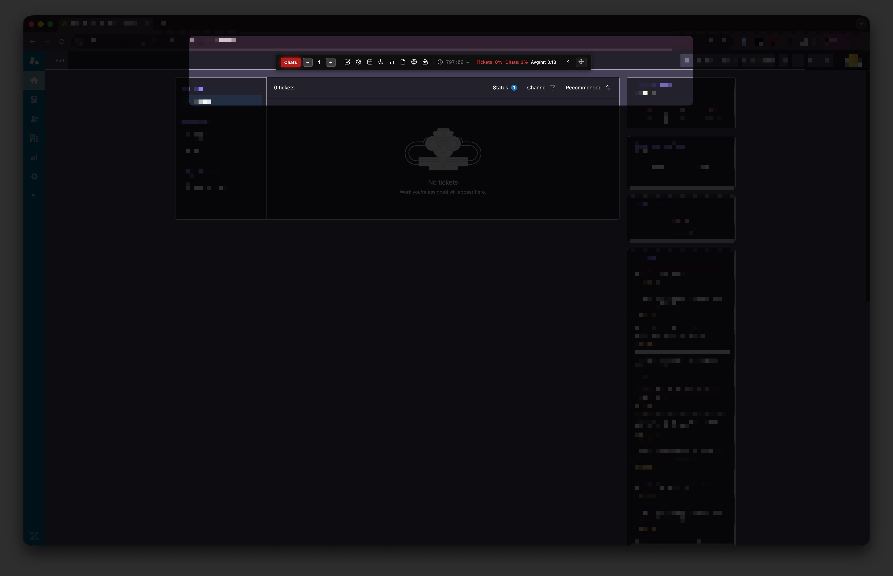
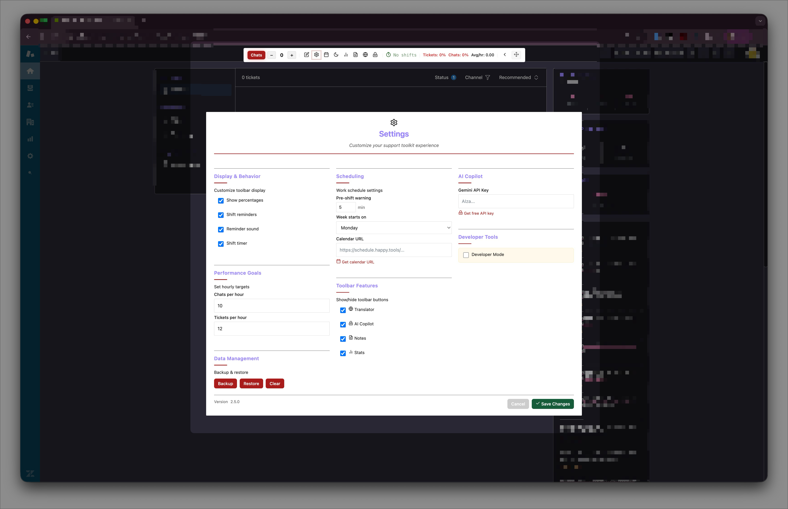
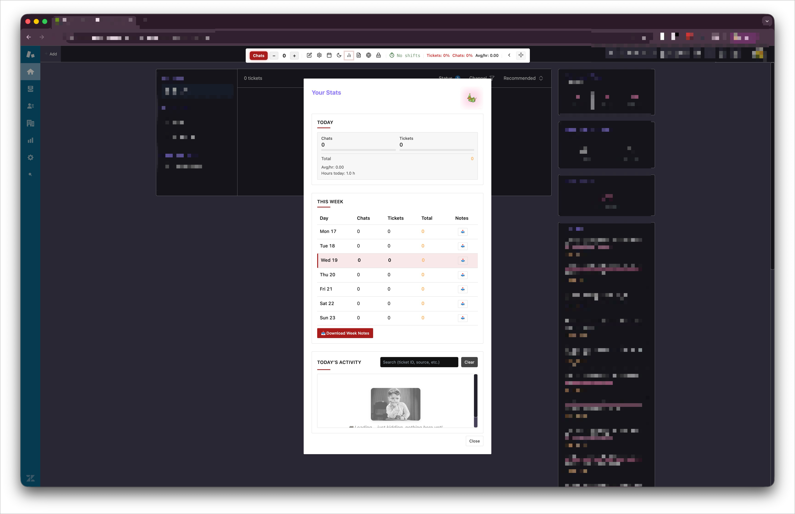

# Support Toolkit

<div align="center">

**A Chrome Extension for Happiness Engineers at Automattic**

*Quality-of-life improvements for customer support workflows on Zendesk*

[](https://chromewebstore.google.com/detail/support-toolkit/gnjghfobmfiilldpoedmjfdfehkohefk)
[](https://github.com/Automattic/support-toolkit)
[](LICENSE)
[](https://developer.chrome.com/docs/extensions/mv3/intro/)

[Features](#features) • [Installation](#installation) • [Usage](#usage) • [Development](#development) • [Contributing](#contributing)

</div>

---

## Screenshots

<div align="center">

### Toolbar


### Settings Panel


### Weekly Stats


</div>

---

## Overview

**Support Toolkit** is a productivity-enhancing Chrome extension originally built as an interaction tracker for Happiness Engineers at Automattic, now evolved into a comprehensive support tool. It integrates seamlessly with Zendesk to provide real-time tracking, AI assistance, shift management, and analytics—all in a delightful, non-intrusive interface.

### What is it?

A floating toolbar that lives in your Zendesk workspace, giving you:
- **Real-time counters** for chats and tickets with auto-increment detection
- **Shift timing** with ICS calendar integration and countdown timers
- **Built-in notes** system for quick reference
- **Statistics & analytics** to track your performance
- **AI copilot** powered by Google Gemini (optional)
- **Audio/visual notifications** for shift transitions
- **Seasonal themes** including Christmas glassmorphism UI

---

## Features

### 📊 Interaction Tracking
- **Live counters** for chats and tickets
- **Auto-increment detection** observes Zendesk DOM for ticket resolutions
- **Manual controls** to increment/decrement as needed
- **Goal tracking** with hourly targets and completion percentages
- **Persistent storage** across sessions with Chrome Storage API
- **Daily/weekly/monthly statistics** with visual breakdowns

### ⏰ Shift Management
- **ICS calendar integration** syncs with schedule.happy.tools
- **Live countdowns** show time remaining in current shift
- **Shift detection** automatically identifies chat vs ticket shifts
- **Pre-shift warnings** with configurable lead time
- **End-of-shift alerts** with audio notifications
- **Today's schedule viewer** with hours breakdown

### 📝 Notes System
- **Rich text editor** for quick notes
- **Category-based organization** for easy retrieval
- **Search and filter** functionality
- **Export capabilities** for backup
- **Persistent storage** synced across devices

### 🤖 AI Copilot
- **Google Gemini 2.5 Flash** integration
- **Context-aware assistance** for support queries
- **Background service worker** processing
- **User-provided API key** for privacy
- **Rate limiting** and error handling

### 📈 Statistics & Analytics
- **Daily/weekly/monthly breakdowns** of interactions
- **Average response times** calculated per shift
- **Interaction trends** visualization
- **Activity logs** with detailed timeline
- **Export functionality** for reports

### 🎨 Theming & Customization
- **Light and dark modes** for any lighting condition
- **Christmas theme** with glassmorphism effects, snowfall animations, and custom SVG decorations
- **Draggable toolbar** - position anywhere on screen
- **Customizable goals** for chats and tickets per hour
- **Feature toggles** for reminders, sounds, and auto-increment

### 🔊 Notifications
- **Toast notifications** for events
- **Audio alerts** for shift transitions (shift-alert.mp3)
- **Visual indicators** for active shifts
- **Configurable preferences** per user
- **Non-intrusive design** that doesn't block workflow

---

## Installation

### From Chrome Web Store

**[Install from Chrome Web Store](https://chromewebstore.google.com/detail/support-toolkit/gnjghfobmfiilldpoedmjfdfehkohefk)**

1. Click the link above
2. Click "Add to Chrome"
3. Confirm the permissions
4. The extension will be installed and ready to use on Zendesk pages

### From Source (Development)

1. **Clone the repository:**
   ```bash
   git clone https://github.com/mauropereiira/support-toolkit.git
   cd support-toolkit
   ```

2. **Load in Chrome:**
   - Open Chrome and navigate to `chrome://extensions/`
   - Enable **Developer mode** (toggle in top-right corner)
   - Click **Load unpacked**
   - Select the **`extension`** folder (not the root directory)
   - The Support Toolkit icon should appear in your toolbar

### For Team Members (Direct Install)

1. **Download the ZIP:** Get the latest `Support-Toolkit-v2.5.0-team.zip` from your team's distribution channel
2. **Extract:** Unzip to a permanent location on your computer
3. **Load in Chrome:**
   - Open `chrome://extensions/`
   - Enable **Developer mode**
   - Click **Load unpacked**
   - Select the extracted `extension` folder

3. **Verify installation:**
   - Navigate to any Zendesk page (e.g., `*.zendesk.com`)
   - The floating toolbar should appear in the top-right corner
   - If not visible, refresh the page

---

## Usage

### Getting Started

1. **Navigate to Zendesk:**
   - Open any Zendesk workspace page
   - The toolbar appears automatically in the top-right

2. **Initial Setup:**
   - Click the settings icon (⚙️)
   - Configure your preferences:
     - **Calendar URL**: Paste your ICS URL from schedule.happy.tools
     - **Hourly Goals**: Set targets for chats/tickets per hour
     - **Notifications**: Enable shift reminders and audio alerts
     - **Theme**: Choose light or dark mode

3. **Start Tracking:**
   - Click `+` buttons to manually log chats/tickets
   - Auto-increment will detect Zendesk ticket resolutions
   - Switch between "CHATS" and "TICKETS" modes as needed

### Core Workflows

#### Tracking Interactions
- **Manual increment**: Click `+ Chat` or `+ Ticket`
- **Manual decrement**: Click the counter number itself
- **Auto-detection**: Extension observes Zendesk DOM (must be enabled in settings)
- **View stats**: Click toolbar to expand and see today's metrics

#### Managing Your Shift
- **View schedule**: Click "Schedule" button to see today's events
- **Monitor countdown**: Toolbar displays time remaining in current shift
- **Switch modes**: Click "CHATS" or "TICKETS" (5-minute grace period prevents accidents)
- **Receive alerts**: Notifications appear 5 minutes before shift and at shift end

#### Using Notes
- Open notes modal from toolbar
- Create, edit, delete notes
- Organize by category
- Search/filter as needed

#### AI Assistance (Optional)
- Add your Google Gemini API key in settings
- Click AI button for context-aware help
- Ask questions about tickets, customers, or workflows

#### Viewing Statistics
- **Quick view**: Expand toolbar for today's summary
- **Detailed stats**: Click "Statistics" for weekly history
- **Activity log**: See timeline of all interactions
- **Export data**: Backup your stats from settings

### Configuration Options

**Settings Modal (⚙️):**

| Setting | Description |
|---------|-------------|
| **Calendar URL** | ICS calendar URL from schedule.happy.tools |
| **Chat Goal (per hour)** | Target number of chats per hour |
| **Ticket Goal (per hour)** | Target number of tickets per hour |
| **Enable Shift Reminders** | Pre-shift notifications |
| **Warning Time** | Minutes before shift to show reminder |
| **End-of-Shift Alerts** | Notifications when shift ends |
| **Audio Notifications** | Enable sound alerts |
| **Theme** | Light or dark mode |
| **Auto-Increment** | Automatic ticket detection |
| **Dev Mode** | Enable testing tools |

**Toolbar Customization:**
- **Drag to reposition**: Click and hold to move toolbar
- **Reset position**: Available in settings if toolbar gets stuck

### Keyboard Shortcuts

*Coming soon - configurable shortcuts for common actions*

---

## Development

### Prerequisites

- Google Chrome (version 90+)
- Text editor (VS Code, Sublime, etc.)
- Basic knowledge of JavaScript and Chrome Extensions

### Project Structure

```
support-toolkit/
├── extension/                     # Chrome extension files
│   ├── manifest.json              # Extension configuration (Manifest V3)
│   ├── background.js              # Service worker for AI API calls
│   ├── content.js                 # Main UI logic
│   │
│   │   # Core modules
│   ├── storage.js                 # Chrome Storage abstraction with caching
│   ├── events.js                  # Event bus for decoupled communication
│   ├── state.js                   # Centralized state management
│   ├── timer-manager.js           # Unified timer for all recurring tasks
│   │
│   │   # Feature modules
│   ├── schedule.js                # Calendar parsing & shift calculations
│   ├── theme.js                   # Theme management & toolbar positioning
│   ├── notes.js                   # Notes system
│   ├── translator.js              # Translation service
│   ├── ai-panel.js                # AI Copilot panel
│   ├── auto-count.js              # Auto-increment on ticket resolution
│   │
│   │   # Infrastructure
│   ├── timers.js                  # ICS parsing & shift detection
│   ├── notifications.js           # Notification orchestration
│   ├── notification-utils.js      # Toast UI components
│   ├── error-handler.js           # Centralized error handling
│   ├── config.js                  # Feature flags & limits
│   ├── constants.js               # Global constants
│   ├── utils.js                   # Helper functions
│   ├── icons.js                   # Dynamic SVG rendering
│   ├── ui-helpers.js              # UI utility functions
│   │
│   │   # Styles
│   ├── styles.css                 # Main stylesheet
│   │
│   │   # Assets
│   ├── icons/                     # Extension icons (48px, 128px)
│   ├── images/                    # UI assets
│   └── sounds/                    # Audio files
│
├── .claude/                       # Development agents (not in extension)
│   └── commands/                  # Custom Claude commands
│
├── README.md                      # This file
├── 1.jpg, 2.jpg, 3.jpg           # Screenshots
└── .gitignore                     # Git ignore rules
```

### Architecture

**Technology Stack:**
- **Vanilla JavaScript (ES6+)** - No frameworks or build tools
- **CSS3** - Advanced features (backdrop-filter, animations)
- **Chrome Extension Manifest V3** - Latest standard
- **Chrome Storage API** - Sync and local storage

**Module Pattern:**
- Uses IIFE (Immediately Invoked Function Expression)
- Global namespaces: `window.ZD*`
  - `ZDStorage` - Data layer with caching
  - `ZDEvents` - Event bus
  - `ZDState` - Centralized state
  - `ZDTimerManager` - Unified timer
  - `ZDSchedule` - Calendar/shift logic
  - `ZDTheme` - Theme management
  - `ZDNotes` - Notes system
  - `ZDTranslator` - Translation
  - `ZDAIPanel` - AI Copilot
  - `ZDAutoCount` - Auto-increment
  - `ZDTimers` - Shift timing
  - `ZDNotifications` - Alerts
  - `ZDUtils` - Helpers
  - `ZDConfig` - Configuration
  - `ZDErrorHandler` - Error handling
  - `ZDConstants` - Constants

**File Load Order** (Critical - defined in manifest.json):
1. `error-handler.js` - Must be first
2. `config.js` - Configuration
3. `utils.js` - Utilities
4. `constants.js` - Constants
5. `storage.js` - Storage layer
6. `events.js` - Event bus
7. `state.js` - State management
8. `notification-utils.js` - Toast UI
9. `notifications.js` - Notification system
10. `timers.js` - Timing engine
11. `icons.js` - Icon rendering
12. `ui-helpers.js` - UI utilities
13. `theme.js` - Theme management
14. `schedule.js` - Calendar logic
15. `notes.js` - Notes system
16. `translator.js` - Translation
17. `ai-panel.js` - AI Copilot
18. `auto-count.js` - Auto-increment
19. `timer-manager.js` - Unified timer
20. `content.js` - Main app (must be last)

### Local Development

1. **Make changes** to source files

2. **Reload extension:**
   - Go to `chrome://extensions/`
   - Click reload icon on Support Toolkit card
   - Or use `Ctrl+R` while focused on extension

3. **Test changes:**
   - Navigate to Zendesk page
   - Open DevTools console
   - Look for `[Support Toolkit]` prefixed logs

4. **Debug:**
   - Enable dev mode in settings
   - Use manual controls to test features
   - Inspect Chrome Storage: `chrome://extensions/` → Details → Storage

### Testing

**Manual Testing Checklist:**
- [ ] Extension loads without console errors
- [ ] Toolbar renders on Zendesk pages
- [ ] Counters increment/decrement correctly
- [ ] Settings modal opens and saves preferences
- [ ] Notes CRUD operations work
- [ ] Statistics display accurately
- [ ] Shift timers countdown correctly
- [ ] Audio notifications play
- [ ] Backup/restore functionality works
- [ ] Theme switching works
- [ ] Toolbar dragging works
- [ ] Auto-increment detects Zendesk actions

**Dev Mode Features:**
- Manual day change controls
- Force shift reminder testing
- Direct access to storage data
- Debugging tools

### Coding Guidelines

**Naming Conventions:**
- CSS classes: `.zd-*` prefix (e.g., `.zd-toolbar`, `.zd-modal`)
- JavaScript namespaces: `ZD*` prefix (e.g., `ZDStorage`, `ZDUtils`)
- Variables: camelCase
- Constants: UPPER_SNAKE_CASE
- Functions: descriptive verbs (e.g., `handleClick`, `renderModal`)

**Best Practices:**
- Always use `ZDStorage` for data operations, never direct Chrome API
- All async operations must have try-catch with error handler
- Use feature flags in `config.js` for new features
- Validate all user inputs with schemas
- Add `[Support Toolkit]` prefix to console logs
- Preserve vanilla JavaScript - no frameworks
- GPU-accelerate animations (use `transform` and `opacity`)
- Test on actual Zendesk pages

### API Integrations

**Google Gemini 2.5 Flash:**
- Endpoint: `https://generativelanguage.googleapis.com/v1/models/gemini-2.5-flash:generateContent`
- User provides their own API key
- Handled in `background.js` service worker
- Rate limiting implemented

**Schedule Integration:**
- Source: `https://schedule.happy.tools/*`
- Format: ICS calendar files
- Parsed in `timers.js`
- Cached with TTL

---

## Contributing

We welcome contributions from the community! Whether it's bug fixes, new features, documentation improvements, or translations, your help is appreciated.

### How to Contribute

1. **Fork the repository**
   ```bash
   git clone https://github.com/mauropereiira/support-toolkit.git
   cd support-toolkit
   git checkout -b feature/your-feature-name
   ```

2. **Make your changes**
   - Follow coding guidelines above
   - Test thoroughly on Zendesk
   - Add comments for complex logic
   - Update documentation if needed

3. **Commit your changes**
   ```bash
   git add .
   git commit -m "Add: Brief description of your changes"
   ```

4. **Push to your fork**
   ```bash
   git push origin feature/your-feature-name
   ```

5. **Open a Pull Request**
   - Describe what you changed and why
   - Reference any related issues
   - Include screenshots for UI changes
   - Wait for review and feedback

### Contribution Guidelines

Please read [CONTRIBUTING.md](CONTRIBUTING.md) for detailed guidelines on:
- Code style and conventions
- Commit message format
- Pull request process
- Issue reporting
- Development workflow

### Code of Conduct

This project adheres to a Code of Conduct. By participating, you are expected to uphold this code. Please read [CODE_OF_CONDUCT.md](CODE_OF_CONDUCT.md).

---

## Security

### Reporting Security Issues

If you discover a security vulnerability, please do **NOT** open a public issue. Instead, email us directly at mauro.brito@hotmail.com or see [SECURITY.md](SECURITY.md) for details.

### Security Features

- No inline scripts or styles (CSP compliant)
- All user input sanitized before DOM insertion
- API keys stored in Chrome Storage (encrypted by Chrome)
- No external data transmission except approved APIs
- No eval() or Function() constructors

---

## Browser Compatibility

- **Chrome** (version 90+) - Fully supported
- **Edge** (Chromium-based) - Fully supported
- **Brave** - Fully supported
- **Opera** - Fully supported
- **Firefox** - Not supported (Manifest V3 differences)
- **Safari** - Not supported (no Manifest V3)

---

## Privacy

Support Toolkit respects your privacy:
- **All data stored locally** in Chrome Storage API
- **No analytics or tracking** - we don't collect usage data
- **No external data transmission** except:
  - ICS calendar fetching (if you configure it)
  - Google Gemini API calls (if you provide API key)
- **No telemetry** - extension doesn't "phone home"
- **Open source** - audit the code yourself

---

## Permissions Explained

The extension requires these Chrome permissions:

| Permission | Why We Need It |
|------------|----------------|
| `storage` | Save your counters, settings, and history locally |
| `https://*.zendesk.com/*` | Inject the toolbar into Zendesk pages |
| `https://*.zopim.com/*` | Support for Zendesk Chat |
| `https://schedule.happy.tools/*` | Fetch your ICS calendar |
| `https://generativelanguage.googleapis.com/*` | AI copilot (Google Gemini) |

---

## Roadmap

### Planned Features
- [ ] Multi-browser support (Firefox, Safari)
- [ ] Customizable keyboard shortcuts
- [ ] Data export formats (JSON, CSV, Excel)
- [ ] Statistics visualization library
- [ ] Team leaderboards (optional)
- [ ] Offline mode improvements
- [ ] Generic support agent mode (non-Zendesk)
- [ ] Mobile companion app

### In Progress
- [ ] Chrome Web Store listing
- [ ] Improved documentation
- [ ] Unit tests
- [ ] CI/CD pipeline

### Completed
- [x] Core counter system
- [x] Shift management
- [x] ICS calendar integration
- [x] Statistics tracking
- [x] AI copilot
- [x] Notes system
- [x] Christmas theme
- [x] Audio notifications

---

## Changelog

See [CHANGELOG.md](CHANGELOG.md) for a detailed version history.

**Current Version: 2.5.1**
- Architecture refactoring with modular design (9 new modules)
- Event bus pattern for decoupled communication
- Centralized state management
- Unified timer manager (consolidates 8 intervals into 1)
- Config/counts caching for better performance
- Security fixes (XSS prevention)
- Bug fixes (weekly stats, clear button)
- Christmas theme with glassmorphism UI
- Sound system with 7 sound types

---

## License

This project is licensed under the MIT License - see the [LICENSE](LICENSE) file for details.

---

## Acknowledgments

Built with love for **Happiness Engineers at Automattic** by support agents who understand the daily grind.

Special thanks to:
- The Automattic Happiness team for feedback and feature ideas
- Open source contributors who make projects like this possible
- The Chrome Extensions team for excellent documentation

---

## Support & Contact

- **Issues**: [GitHub Issues](https://github.com/mauropereiira/support-toolkit/issues)
- **Discussions**: [GitHub Discussions](https://github.com/mauropereiira/support-toolkit/discussions)
- **Email**: mauro.brito@hotmail.com

---

## Star History

If you find this project useful, please consider giving it a star on GitHub!

[](https://github.com/mauropereiira/support-toolkit/stargazers)

---

<div align="center">

**Made with ❤️ by support agents, for support agents**

[⬆ Back to Top](#support-toolkit)

</div>
